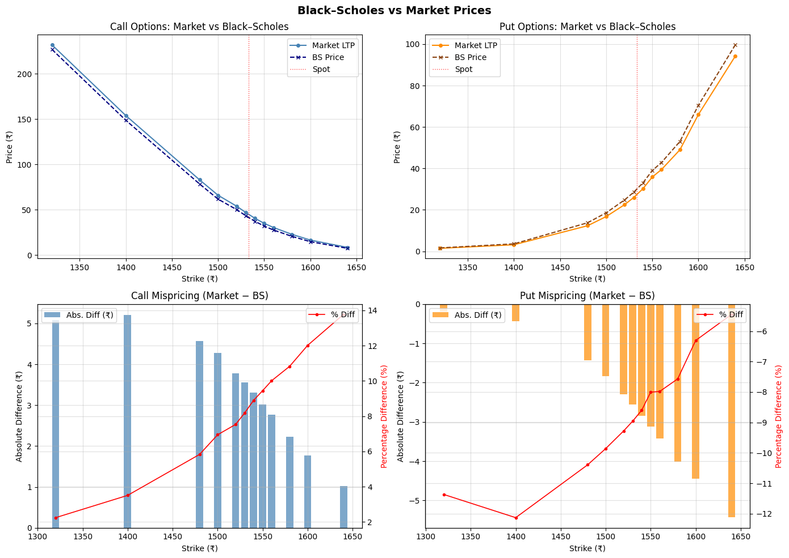
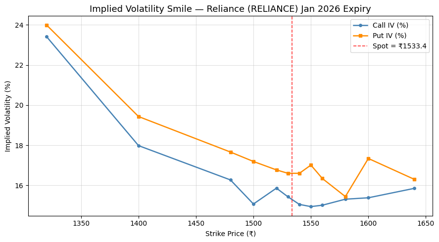
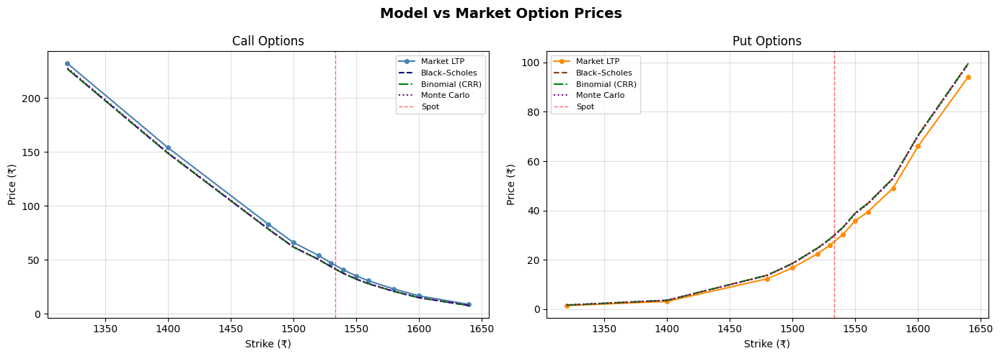

# European Options Pricing & Mispricing Analysis

A comprehensive quantitative finance project implementing analytical and numerical option pricing models to evaluate European call and put options using real **NSE option-chain data for Reliance Industries (RELIANCE)**. The project compares theoretical prices with observed market prices, analyzes implied volatility, computes option Greeks, and visualizes pricing deviations across multiple pricing models.

---

## Highlights

* Implemented the **Black–Scholes analytical pricing model** for European options.
* Computed **Delta, Gamma, Vega, Theta, and Rho** for call and put options.
* Analyzed the **Implied Volatility Smile** using market data.
* Developed **Binomial (CRR)** and **Monte Carlo** pricing models from scratch.
* Compared theoretical option prices with observed market prices.
* Visualized pricing deviations using Python.

---

## Project Overview

Option pricing plays a fundamental role in quantitative finance and derivatives trading. This project evaluates European options using analytical and numerical pricing techniques while comparing theoretical valuations against real market observations.

The analysis covers four widely used pricing approaches:

* Black–Scholes Model
* Black–Scholes Greeks
* Cox–Ross–Rubinstein (CRR) Binomial Model
* Monte Carlo Simulation

The project also investigates implied volatility behaviour through volatility smile analysis and compares theoretical prices with market prices to identify pricing deviations.

---

## Objectives

* Price European Call and Put options using Black–Scholes.
* Compute and analyze option Greeks.
* Study implied volatility behaviour across strike prices.
* Implement Binomial and Monte Carlo pricing models.
* Compare theoretical prices with market prices.
* Analyze pricing deviations across pricing models.

---

## Dataset

The analysis uses **real NSE option-chain data for Reliance Industries (RELIANCE)** with **27 January 2026 expiry**.

The dataset contains:

* Strike Prices
* Call & Put Last Traded Prices (LTP)
* Bid–Ask Prices
* Open Interest
* Implied Volatility

Dataset:

```text
data/option_chain_data.csv
```

---

## Pricing Models

### Black–Scholes Model

Implemented the analytical Black–Scholes model for pricing European call and put options under the assumptions of constant volatility, log-normal asset prices, no arbitrage, and constant risk-free interest rate.

---

### Option Greeks

Computed the following sensitivity measures:

* Delta
* Gamma
* Vega
* Theta
* Rho

The Greeks were visualized against strike prices to study option sensitivity across moneyness.

---

### Implied Volatility Smile

Analyzed the variation of implied volatility with strike price to observe deviations from the constant volatility assumption of the Black–Scholes model.

---

### Binomial (CRR) Model

Implemented a multi-step Cox–Ross–Rubinstein Binomial Tree for pricing European options using backward induction under the risk-neutral framework.

---

### Monte Carlo Simulation

Implemented Monte Carlo pricing using Geometric Brownian Motion to estimate option values through stochastic simulation of future stock price paths.

---

## Repository Structure

```
Options-pricing-analysis/
│
├── data/
│   └── option_chain_data.csv
│
├── notebooks/
│   └── options_pricing_analysis.ipynb
│
├── report/
│   └── options_pricing_report.pdf
│
├── results/
│   ├── black_scholes_vs_market.png
│   ├── greeks_vs_strike.png
│   ├── implied_volatility_smile.png
│   └── market_vs_pricing_models.png
│
├── requirements.txt
├── LICENSE
└── README.md
```

---

## Results

The notebook generates:

* Black–Scholes option prices
* Option Greeks
* Implied Volatility Smile
* Binomial option prices
* Monte Carlo option prices
* Market vs Model comparison plots

### Black–Scholes vs Market Prices



---

### Option Greeks


---

### Implied Volatility Smile



---

### Market vs Pricing Models



---

## Key Findings

* Black–Scholes provides an efficient analytical benchmark for European option pricing.
* Option Greeks effectively quantify price sensitivity to changes in market variables.
* The implied volatility smile demonstrates that market volatility varies across strike prices rather than remaining constant.
* Binomial pricing closely approximates analytical Black–Scholes results while providing a discrete-time valuation framework.
* Monte Carlo simulation offers a flexible numerical approach suitable for complex derivative pricing.
* Comparison with market prices highlights pricing deviations arising from market expectations, liquidity, volatility dynamics, and simplifying model assumptions.

---

## Technologies Used

* Python
* NumPy
* Pandas
* SciPy
* Matplotlib
* Jupyter Notebook

---

## Installation

Clone the repository

```bash
git clone https://github.com/PravallikaMatha/Options-pricing-analysis.git
```

Install dependencies

```bash
pip install -r requirements.txt
```

Run the notebook

```bash
jupyter notebook notebooks/options_pricing_analysis.ipynb
```

---

## References

* John C. Hull — *Options, Futures and Other Derivatives*
* Black & Scholes (1973)
* Cox, Ross & Rubinstein (1979)
* Paul Glasserman — *Monte Carlo Methods in Financial Engineering*

---

## Authors

**Pravallika Matha**
GitHub: https://github.com/PravallikaMatha

**Gullapalli Kavya Durga Sri**
GitHub: https://github.com/<kavya-github-username>

